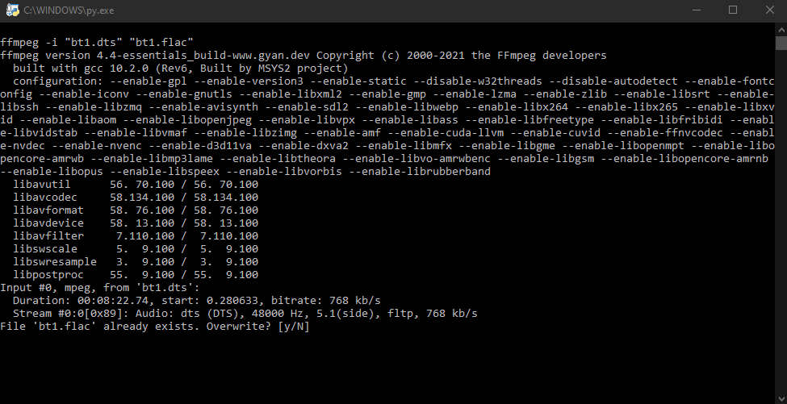

# dts2flac (using python and ffmpeg)

> install ffmpeg [here](https://ffmpeg.org/)

# Usage
- install ffmpeg
- ensure command prompt can find it (e.g. its added to path)
- copy the ```dts2flac.py``` script to directory you want to convert
- double click on the ```.py``` script
- ffmpeg will convert the files
- once complete terminal window will ```pause```, hit enter to close or review log

# Code Snip
The python code is relatively simple and uses 3 standard modules, os to execute windows commands, glob to filter through the list of directories and re to rename the files cleanly:

```py
"""dts2flac uses python and ffmpeg to conert dts files to flac for use in kodi"""
import os, glob, re

# grab a list of .dts files from the current directory (note: case insensitive)
paths = glob.glob("*.dts")

# for each "input" .dts file, create a output string with .flac; which also informs ffmpeg of the type to convert
for input in paths:
	output = re.sub("(.+)\.dts$", "\g<1>.flac", input, flags=re.IGNORECASE)
	exectuteString:str = 'ffmpeg -i "{}" "{}"'.format(input, output)
	print("\n" + exectuteString) # prints out the ffmpeg converstion string
	os.system(exectuteString)

# wait for user confirmation
os.system("pause")
```

# Screenshot



# Copyright
MIT (see licence file)